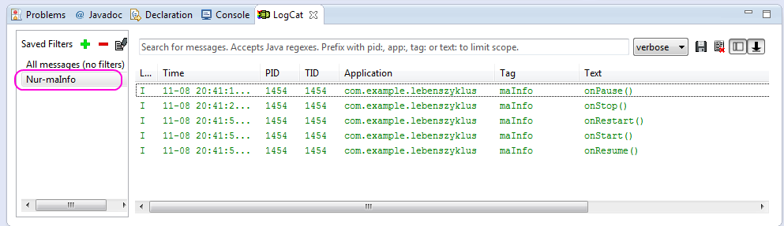

# 2.Lebenszyklus-einer-App

Während der Benutzung einer App z.B. Web-Browser kann es zu Unterbrechungen durch einen eingehenden Anruf kommen.  
Die Erwartungshaltung ist natürlich diese, daß nach dem Anruf mit dem Web-Browser weiterhin gearbeitet werden kann.  
Dieses Verhalten wird über die Lebenszyklen einer App realisiert.  
Wie diese in einander greifen ist hier beschrieben:  
http://developer.android.com/reference/android/app/Activity.html

__Aufgabenstellung__

Um sich einen Überblick über die Lebenzyklen zu verschaffen und wann in diese eingetreten wird und wann diese wieder verlassen werden, ist eine entsprechende App zu bauen.  
Vorlage ist nachfolgendes Code-Gerüst.

```java
public class Activity extends ApplicationContext {
    protected void onCreate(Bundle savedInstanceState);

    protected void onStart();
     
    protected void onRestart();

    protected void onResume();

    protected void onPause();

    protected void onStop();

    protected void onDestroy();
}
```

Dazu ist jede einzelne Methode mit Programm-Code zu beleben und zwar so:

```java
	@Override
	protected void onStart() {

		// Expliziter Aufruf der geerbten Methode
		super.onStart();

		// Aufruf in der 'LogCat'-Console festhalten
		Log.i("maInfo", "onStart()");
		
	}
```

__Hilfestellung__

Wenn die App einmal im Emulator läuft, kommen jeder Menge Log-Messages in der _LogCat_-Konsole zur Darstellungen, welche uns in ihrer Gesamtheit etwas den Blick für _unsere_ eigenen Messages verschleiern.  


Dem läßt sich jedoch abhelfen.  
Dazu betätige man das markierte  und es erscheint folgender Dialog:

 

Nach erfolgte Eingabe und bestätigen mit 'OK' sollte es in der _LogCat_-Konsole so aussehen:



Der neu erstellte Filter erscheint nun auf der linken Seite der _LogCat_-Konsole.

__Vorschau auf die App__


__Lern-Ziel__

- Eine erste, eigene App zu erstellen.

- Mittels dieser App __und__ spielerischen Umgang mit dem Emulator soll vermittelt werden, wann unsere App welche Zustände durchläuft.
Der Wechsel dieser Zustände wird in der 'LogCat'-Konsole sichtbar.

- Nicht erwünschte Log-Messages lassen sich per *Message Filter* bei Bedarf ausblenden.


__P.S:__  
Wer schon einmal mit den sogenannten [Zustands-Maschinen/state machines](http://de.wikipedia.org/wiki/Endlicher_Automat) in Berührung kam, wird diese unschwer wiedererkennen.


